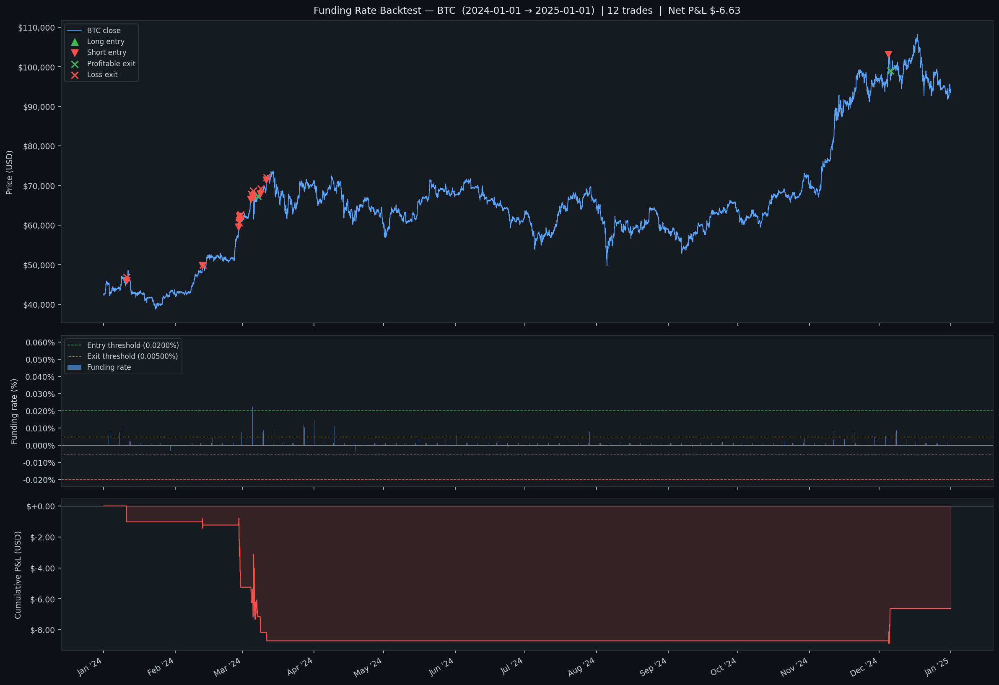
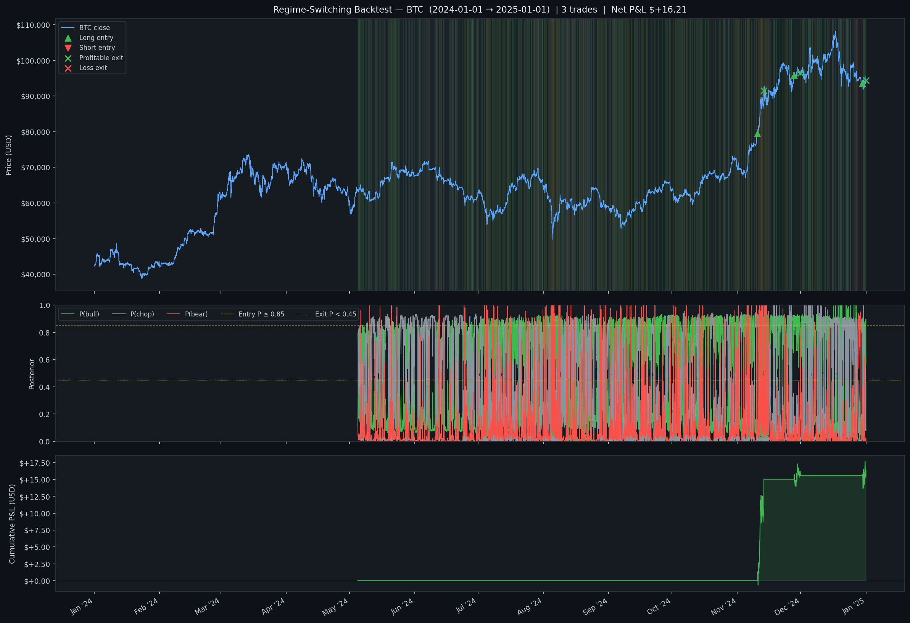

# trading

Algorithmic trading bot for [Hyperliquid](https://hyperliquid.xyz) perpetual futures, written in Python.

## Strategies

### Funding Rate
Collects funding payments by sitting on the receiving side when rates are extreme.

- **Positive funding** → opens short (longs pay us hourly)
- **Negative funding** → opens long (shorts pay us hourly)

Exits when funding normalises, flips, a 2% stop loss fires, or the 48h time cap is hit. No price prediction — purely a carry trade on crowded positioning.

Default parameters (conservative, small account):

| Parameter | Value | Notes |
|---|---|---|
| Position size | $50 notional | |
| Leverage | 1x cross | |
| Entry threshold | 0.02%/hr | ≈175%/yr annualised |
| Exit threshold | 0.005%/hr | rate no longer worth holding |
| Stop loss | 2% | hard directional cut |
| Max hold | 48h | time cap regardless of funding |
| Poll interval | 10 min | REST API, not WebSocket |

### Regime Switching
Fits a 3-state Gaussian Hidden Markov Model (HMM) to hourly log returns and labels every bar as **bear**, **chop**, or **bull** by sorting the latent states on emission mean. Tuned for a **low-frequency, high-confidence** style: only a few trades a year, each one only opened after the model has been confident in the same direction for several hours, then held until the regime itself changes. Slippage and fees on small notional are non-trivial, so trade count is deliberately suppressed.

- **P(bull) ≥ 0.85** sustained for `entry_confirmation_bars` (8 hours by default) → opens long
- **P(bear) ≥ 0.85** sustained for `entry_confirmation_bars` → opens short
- Confirmation gate prevents entries on brief posterior spikes that revert; the candidate regime must be the entry signal for N consecutive bars before any order fires
- Holds for at least `min_hold_bars` (3 days) so the smoothed posterior can't whipsaw a fresh entry
- Exits when the held regime's posterior drops below 0.45, the opposite regime takes over, the wide 12% stop fires, or the 60-day time cap is hit — there is **no fixed take-profit**
- After exit, refuses to re-enter the *same* regime for `same_regime_cooldown_bars` (14 days) so we don't immediately re-open the trade we just closed

The HMM is refit on a rolling 3000-bar window every `refit_every_bars` (weekly by default). Implementation is pure NumPy (`strategies/hmm.py` for forward-backward / Viterbi / Baum-Welch, `strategies/regime.py` for the 3-state wrapper). See `strategies/configs.py:RegimeSwitchingConfig` for the full parameter set, and `tools/regime_sweep.py` for the parameter-sweep harness used to pick the defaults.

## Backtest results

### Funding rate — BTC 2024 | 12 trades | Net P&L: -$6.63



The three panels show: BTC price with labelled long/short entries and profitable/loss exits; the hourly funding rate against entry (0.02%/hr) and exit (0.005%/hr) thresholds; and cumulative USD P&L over the year. The strategy captured several high-funding episodes but gave back gains during the flat mid-year period, finishing slightly negative at $50 notional / 1× leverage — consistent with a conservative parameter set on a year where funding was often below threshold.

### Regime switching — BTC 2024 | 3 trades | Net P&L: +$16.21 | Sharpe 2.20



Run with `python regime_backtest.py --coin BTC --start 2024-01-01 --end 2025-01-01 --refit-every 336 --chart`. The three panels show: BTC price with regime-shaded background (red=bear, grey=chop, green=bull) and labelled trade entries/exits; the rolling smoothed posteriors P(bear), P(chop), P(bull) with the entry/exit thresholds; and cumulative USD P&L.

The strategy went through three tuning iterations:

| Iteration | Trades | Net P&L | Sharpe | Notes |
|---|---|---|---|---|
| 1. Baseline (`P≥0.65, 3% stop, 6% TP, no confirm`) | 315 | -$2.48 | -0.12 | Whipsaws — 298/315 exits on `regime_weakened` |
| 2. Ride-the-regime (`P≥0.85, 12% stop, no TP, 7d cooldown`) | 28 | +$30.16 | 1.49 | Zero stop-outs, but 2-3 trades/month |
| 3. Low-frequency (`+ 8h confirmation, 14d cooldown, 60d max-hold`) | **3** | **+$16.21** | **2.20** | ~1 trade per 4 months |

The shift from iteration 2 → 3 trades total throughput (P&L per year drops ~50%) for **per-trade efficiency** (P&L per trade jumps from $1.08 → $5.40) and far less exposure to slippage and fees. With $100 notional and 1× leverage, a $5/trade average is several times the round-trip taker fee, which is the right margin of safety for small accounts.

Result on BTC 2024: **3 trades (3 long / 0 short), 100% win rate, 61.7h avg hold, +$16.21 net at $100 notional / 1×, Sharpe 2.20, max drawdown -4% of position size, 2 of 3 exits via `regime_weakened`** (the third was the open trade closed at the end of the backtest). Defaults picked by `tools/regime_sweep.py`, which compares 10 low-frequency configurations.

**Caveats — read these before deploying:** *(1)* `n=3` trades means single-trade noise dominates: a 100% win rate is essentially noise, and one unlucky regime call would flip the year's metrics dramatically. *(2)* This is a single-period in-sample fit on a single coin — running the same sweep on ETH and on 2022/2023 BTC is the obvious next step before trusting these defaults out-of-sample. *(3)* Long-only on this period — bear regimes never sustained the 8-bar confirmation gate, so the strategy never went short; that may be a 2024-specific artefact (BTC was largely up-trending) or a structural bias of the gate.

## Setup

**Requirements:** Python 3.11+

```bash
git clone https://github.com/<you>/trading
cd trading

python -m venv .venv && source .venv/bin/activate

pip install \
  "hyperliquid-python-sdk>=0.9.0" \
  "pandas>=2.2.0" "numpy>=1.26.0" \
  "python-dotenv>=1.0.0" "loguru>=0.7.0" \
  "websockets>=12.0" "aiohttp>=3.9.0" \
  "eth-account>=0.10.0"
```

## Configuration

```bash
cp .env.example .env
```

Edit `.env`:

```env
HL_PRIVATE_KEY=0x...          # wallet private key
HL_ACCOUNT_ADDRESS=0x...      # wallet address
HL_TESTNET=true               # set false for mainnet
LOG_LEVEL=INFO
```

> **Never commit `.env`.** It is in `.gitignore`.

## Running

```bash
source .venv/bin/activate
PYTHONPATH=. python main.py --strategy funding --coin BTC
PYTHONPATH=. python main.py --strategy regime  --coin BTC
```

Logs go to stderr and `logs/trading.log`. Example output:

```
INFO | Hyperliquid clients ready | testnet=True
INFO | funding_rate | BTC started | entry≥0.0200%/hr exit≤0.0050%/hr stop=2% size=$50
INFO | BTC | funding=+0.02341%/hr (+205.1%/yr) mid=65432.00 in_position=False
INFO | BTC | entering Sell | funding=+0.02341%/hr size=0.000764 @ 65432.00
INFO | BTC | funding=+0.01100%/hr (+96.4%/yr) mid=65210.00 in_position=True
INFO | BTC | exiting | reasons: funding normalised (+0.00412%/hr)
```

## Project structure

```
trading/
├── config/           # env-based settings
├── data/             # async WebSocket feed (trades + L2 book)
├── execution/        # Hyperliquid client, order manager
├── risk/             # position limits, drawdown guard
├── strategies/
│   ├── base.py               # abstract Strategy base class
│   ├── funding_rate.py       # funding rate carry strategy
│   ├── regime_switching.py   # HMM-based 3-state regime strategy
│   ├── regime.py             # 3-state classifier wrapping the HMM
│   ├── hmm.py                # numpy-only Gaussian HMM
│   ├── configs.py            # strategy parameter dataclasses
│   └── example_momentum.py   # stub example
├── backtesting/
│   ├── engine.py             # funding-rate backtest engine
│   ├── regime_engine.py      # regime-switching backtest engine
│   ├── charts.py             # funding-rate chart
│   ├── regime_charts.py      # regime-switching chart
│   ├── data.py               # cached price + funding history
│   └── metrics.py            # backtest metrics
├── backtest.py       # CLI: funding-rate backtest
├── regime_backtest.py # CLI: regime-switching backtest
├── tools/
│   └── regime_sweep.py # parameter-sweep harness for the regime strategy
├── research/         # Jupyter notebooks
├── tests/
└── main.py           # entry point (--strategy funding|regime)
```

## Writing a new strategy

Subclass `Strategy` and override `run()` for polling strategies or `on_trade`/`on_book` for event-driven ones:

```python
from strategies.base import Strategy

class MyStrategy(Strategy):
    def name(self) -> str:
        return "my_strategy"

    async def run(self) -> None:
        while True:
            # your logic here
            await asyncio.sleep(60)
```

Wire it up in `main.py` alongside the existing strategies.

## Risk management

All orders pass through `RiskManager` before execution:

- Per-order USD cap
- Max total position USD
- Drawdown halt (shuts off trading if equity drops past threshold)

Defaults in `main.py` — adjust to match your account size.

## Disclaimer

This is experimental software. Crypto perpetuals carry liquidation risk. Use testnet first, keep sizes small, and never risk more than you can afford to lose.
