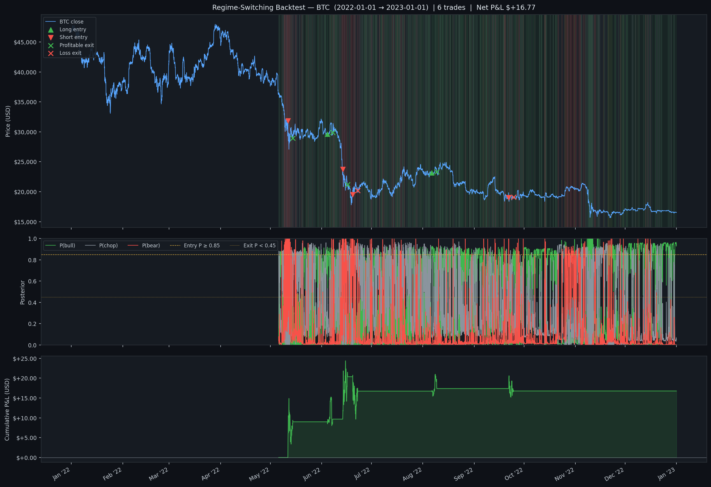

# trading

Algorithmic trading bot for [Hyperliquid](https://hyperliquid.xyz) perpetual futures, written in Python.

A 3-state Hidden Markov Model labels each hourly bar **bear**, **chop**, or **bull**, and the strategy goes with the trend — long in bulls, short in bears, flat in chop.

## Regime switching (HMM)

Fits a 3-state Gaussian Hidden Markov Model to hourly log returns and labels every bar **bear**, **chop**, or **bull** by sorting the latent states on emission mean. Tuned to engage with the market a handful of times per month — opens after the model has been confident in a direction for several consecutive hours, holds until the regime itself changes.

- **P(bull) ≥ 0.85** sustained for `entry_confirmation_bars` (6 hours, long side) → opens **long**
- **P(bear) ≥ 0.85** sustained for `entry_confirmation_bars_short` (3 hours, short side) → opens **short**
- **Asymmetric confirmation gate:** bear regimes in crypto are spikier than bull regimes — they rarely hold long enough to clear a symmetric 8-bar gate, which makes such a gate structurally long-only. The short-side gate is set tighter (3h vs. 6h) so the model engages with bear cycles without dragging long-side quality down.
- **Friction-aware entry gate:** the model's expected return has to clear `2 × TAKER_FEE_RATE + expected_slippage` before a candidate becomes eligible — so the strategy never opens a trade the model itself doesn't expect to pay for its own frictions.
- Holds for at least `min_hold_bars` (3 days) so the smoothed posterior can't whipsaw a fresh entry.
- **Staged soft-exit:** once `min_hold_bars` clears, a posterior in `[exit_proba (0.45), soft_exit_proba (0.60))` reduces by `staged_exit_fraction` (default 50%). Full exit still fires below 0.45.
- Exits when the held regime's posterior drops below 0.45, the opposite regime takes over, the wide 12% stop fires, or the 60-day time cap is hit. **No fixed take-profit.**
- After exit, refuses to re-enter the *same* regime for `same_regime_cooldown_bars` (3 days).
- **Optional vol-scaled sizing:** with `vol_target_per_bar` set, the per-trade notional is scaled by `vol_target / expected_vol` (clipped to `[min_vol_scale, max_vol_scale]`) so risk normalises across regimes. Disabled by default to preserve the BTC-tuned size profile.

The HMM is refit on a rolling 3000-bar window every `refit_every_bars` (weekly by default). Each refit is an *ensemble* of `hmm_n_seeds` (default 5) EM restarts with different random inits; the run with the highest log-likelihood wins. EM is local-optimum sensitive, so this cheaply insulates against landing on a bad mode for a week. A drift monitor fires when a refit shifts the held regime's mean by more than `regime_drift_alert_pct` of the entry-time mean — the failure mode where the model has rotated under an open position. Implementation is pure NumPy (`strategies/hmm.py` for forward-backward / Viterbi / Baum-Welch, `strategies/regime.py` for the 3-state wrapper).

### Backtest — BTC 2024 (bull year) | 12 trades | Net P&L: +$18.82 | Sharpe 1.14


The three panels show BTC price with regime-shaded background (red=bear, grey=chop, green=bull) and labelled trade markers; the rolling smoothed posteriors with entry (0.85) and exit (0.45) thresholds; and the cumulative USD P&L curve. Run with `python regime_backtest.py --coin BTC --start 2024-01-01 --end 2025-01-01 --refit-every 336 --chart`.

**What happened:** the model identified BTC's three big up-legs of 2024 — Feb–Mar, May–Jul, Oct–Dec — and rode each with one or two long entries, holding 60–100 hours apiece. Between them, the brief bear pockets in April and August produced 5 short entries that the asymmetric gate let through; under the prior symmetric config they would have been blocked. 7 longs / 5 shorts, 58% win rate, average hold 79.8 hours, no stop-outs — every exit was the soft `regime_weakened` signal as the smoothed posterior decayed. Drawdown peaked at −24% of position size during a chop-out around late August.

### Backtest — BTC 2022 (bear year) | 6 trades | Net P&L: +$16.77 | Sharpe 0.96



The out-of-sample stress test. BTC fell from $47k to $16k in 2022, with the Luna/Terra unwind in May, the June capitulation, and the FTX collapse in November all visible in the price panel.

**What happened:** the model spotted the regime shifts and shorted into them — 4 of the 6 trades were shorts, all clustered around the major capitulations. The two longs caught the relief rallies between flushes. 67% win rate, +$16.77 net at $100 notional, all exits via `regime_weakened`. The $50k → $16k drawdown in spot is the backdrop against which a +$16 P&L lands; the strategy didn't dodge the bear, it profited from it.

### Tuning history (BTC 2024)

| Iteration | Trades | Net P&L | Notes |
|---|---|---|---|
| 1. Baseline (`P≥0.65, 3% stop, 6% TP, no confirm`) | 315 | −$2.48 | Whipsaws — 298/315 exits on `regime_weakened` |
| 2. Ride-the-regime (`P≥0.85, 12% stop, no TP, 7d cooldown`) | 28 | +$30.16 | Zero stop-outs, but 2–3 trades/month |
| 3. Low-frequency (`+ 8h confirmation, 14d cooldown, 60d max-hold`) | 3 | +$16.21 | ~1 trade per 4 months — but **long-only** even on bear years |
| 4. **Asymmetric gate** (`6h long / 3h short confirm, 3d cooldown`) | **12** | **+$18.82** | Engages with bear cycles; 5 of 12 are shorts |

Iteration 3 looked great on 2024 (+$16, Sharpe 2.20) but produced exactly **one** trade on 2022 — a long, +$0.26 — confirming the gate was structurally long-only. Diagnostic showed bear regimes in BTC 2024 never sustained more than 4 consecutive bars passing the gate, while bull runs reached 17. Lowering only the short-side gate (8 → 3) preserved long-side quality and unlocked the short entries that make 2022 profitable.

### Multi-coin walk-forward validation (2022–2025)

Before committing to mainnet, the strategy was run across 7 coins × 4 years
(392 trades total) under the current BTC-tuned defaults. The full table is
checked in at [`data/walk_forward_2022-2025_7coins.txt`](data/walk_forward_2022-2025_7coins.txt).
Headline per-coin totals:

| Coin | Trades | Win % | Net P&L | Verdict at BTC defaults |
|------|-------:|------:|--------:|-------------------------|
| AVAX | 36 | 55.5 | **+$73.07** | works |
| BTC  | 33 | 54.5 | **+$12.30** | works (barely) |
| ETH  | 39 | 46.2 | −$45.64 | underperforms |
| LINK | 34 | 53.0 | −$35.24 | underperforms |
| SOL  | 71 | 45.1 | −$57.51 | broken on this gate |
| BNB  | 91 | 41.8 | −$95.98 | broken on this gate |
| DOGE | 88 | 44.3 | −$105.22 | broken on this gate |
| **ALL** | **392** | **46.7** | **−$254.22** | mixed |

**Reading this honestly:**

- **BTC** is the only coin the strategy was tuned on, and it remains net
  positive across the 4-year out-of-sample window — but barely, and with a
  losing 2023 and 2024 sandwiched between profitable bookends.
- **AVAX** is the only other coin that clears at the BTC defaults, which is
  a happy surprise — but a single-coin happy surprise across 4 years isn't a
  validated edge.
- **ETH, LINK, SOL, BNB, DOGE** all lose at the BTC-tuned gate. The
  spikier the asset's bear regimes, the worse the BTC-calibrated short
  gate misfires. SOL is the most extreme: 61 of 71 trades are shorts, and
  the strategy is essentially trying to short volatile chop.
- **Conclusion**: the asymmetric gate works on BTC, generalises to AVAX,
  and does not transfer to the rest of the basket without per-coin
  calibration. The [`tools/calibrate_gates.py`](tools/calibrate_gates.py)
  tool exists for exactly that purpose — see "Per-coin calibration" below.

### Caveats before deploying

1. **Deploy on BTC only at first.** The defaults in `main.py` (BTC, $100
   notional, $150 max position, 5% drawdown halt) are the only configuration
   that has positive walk-forward evidence behind it. Other coins need
   per-coin gate calibration *before* they go live.
2. **Sample size.** Even on BTC, 33 trades across 4 years is modest. Per-trade
   noise is meaningful and a losing year is well within the noise envelope.
3. **Drawdown.** A $100 position can lose ~$24 in mark-to-market before the
   regime exit fires (peak observed: −35% of position size in BTC 2024).
   Size your `max_position_usd` accordingly.

### Per-coin calibration

Use `tools/calibrate_gates.py` to scan a coin's history and recommend
`entry_confirmation_bars` / `entry_confirmation_bars_short` from its
regime-streak distribution. Default quantile is 0.25 (permissive — admits
the top ~75% of streaks); pass `--quantile 0.75` for a selective gate that
matches the BTC defaults' quality bar.

```bash
python tools/calibrate_gates.py --coin BTC --quantile 0.75
# RECOMMENDED: entry_confirmation_bars        = 9
#              entry_confirmation_bars_short  = 2
```

For 2024–2026 BTC/ETH/SOL, the selective-quantile recommendations are 9/2,
7/2, 7/2 — i.e. each coin wants its own per-asset values; inheriting BTC's
6/3 across the basket is what produced the underperformance above.

## Pre-mainnet checklist

Before flipping `HL_TESTNET=false`:

- [x] State persistence + startup reconciliation (positions **and** orphan
      open-order detection — `runtime/reconcile.py`)
- [x] Drawdown halt + halt-with-open-position exit-path test
- [x] File-based kill switch (`state/halt.flag`) for halting new entries
      without killing the process
- [x] Trade journal (append-only fills log at `state/fills_{coin}.jsonl`)
      with live-fee capture from the exchange
- [x] Webhook alerting on entries / exits / halts / errors, with a
      background-thread dispatcher so a slow webhook can't freeze the
      event loop
- [x] Heartbeat ping to an external watchdog
- [x] HMM health metrics on every refit (separation, log-likelihood, fit ms)
- [x] HMM ensemble across `hmm_n_seeds` random inits to insulate against
      EM landing on a bad mode
- [x] Regime-mean drift monitor — alerts when a refit moves the held
      regime's mean past the configured drift threshold
- [x] Equity-relative position sizing knob (`position_size_pct`) **and**
      equity-relative risk caps (`max_position_pct` / `max_order_pct`)
- [x] State schema versioning — refuses to silently read a state file
      written by a newer binary
- [x] Fee- and slippage-aware `min_expected_return` floor so the entry
      gate is calibrated to actual frictions
- [x] Funding-rate accrual in the backtest engine
- [x] Optional Prometheus-style `/metrics` endpoint (set `METRICS_PORT`)
      for Grafana dashboards
- [x] Walk-forward validation across coins and years
- [x] Per-coin gate calibration tool
- [ ] 2-week paper / testnet shakeout with alerting and heartbeat wired
- [ ] Confirm the configured webhook URL and heartbeat URL are reachable
      from the host you'll actually run on

The two open boxes are operational, not code — flip them yourself once the
shakeout is clean.

> **Note on the backtest charts above:** the BTC 2024 / 2022 figures
> were generated against the historic configuration
> (`min_expected_return_per_bar=1e-4`, `soft_exit_proba=None`,
> `hmm_n_seeds=1`, no funding accrual). The current defaults are
> friction-aware, stage exits at `soft_exit_proba=0.60`, ensemble the HMM
> over five seeds, and (for the backtest engine) accrue funding when a
> `funding_df` is passed. Rerun
> `python regime_backtest.py --coin BTC --start 2024-01-01 --end 2025-01-01 --refit-every 336 --chart`
> to refresh them against the current defaults.

## Setup

**Requirements:** Python 3.11+

```bash
git clone https://github.com/oscartiz/trading
cd trading

python -m venv .venv && source .venv/bin/activate

pip install \
  "hyperliquid-python-sdk>=0.9.0" \
  "pandas>=2.2.0" "numpy>=1.26.0" \
  "python-dotenv>=1.0.0" "loguru>=0.7.0" \
  "websockets>=12.0" "aiohttp>=3.9.0" \
  "eth-account>=0.10.0"
```

## Configuration

```bash
cp .env.example .env
```

Edit `.env`:

```env
HL_PRIVATE_KEY=0x...          # wallet private key
HL_ACCOUNT_ADDRESS=0x...      # wallet address
HL_TESTNET=true               # set false for mainnet
LOG_LEVEL=INFO

# Operational extras — all optional, leave unset to disable.
ALERT_WEBHOOK_URL=            # Discord-compatible webhook for entries/exits/halts
ALERT_MIN_LEVEL=WARNING       # min loguru level for the webhook sink
HEARTBEAT_URL=                # healthchecks.io / uptime-kuma push URL
HEARTBEAT_INTERVAL_SECONDS=300
METRICS_PORT=                 # optional: bind /metrics on this port (Grafana scrape)
METRICS_HOST=127.0.0.1        # bind host for /metrics (localhost by default)
```

> **Never commit `.env`.** It is in `.gitignore`.

## Running

```bash
source .venv/bin/activate
PYTHONPATH=. python main.py --coin BTC
```

Logs go to stderr and `logs/trading.log`.

## Test-mode runbook

For a multi-day shakeout before live capital, use one of:

```bash
# Paper mode on real mainnet data — simulated fills, no orders sent
HL_TESTNET=false PYTHONPATH=. python main.py --coin BTC --paper --paper-equity 1000

# Real orders on Hyperliquid testnet
HL_TESTNET=true  PYTHONPATH=. python main.py --coin BTC
```

Paper mode does not require `HL_PRIVATE_KEY` — `build_clients(read_only=True)`
skips the wallet entirely and only reads public market data.

For a multi-day run, wrap the command so it survives the terminal closing:

```bash
# Option 1 — tmux (re-attachable)
tmux new -s trading
HL_TESTNET=false PYTHONPATH=. python main.py --coin BTC --paper --paper-equity 1000
# Ctrl-B then D to detach; `tmux attach -t trading` to come back

# Option 2 — nohup (fire-and-forget)
HL_TESTNET=false PYTHONPATH=. nohup python main.py --coin BTC --paper --paper-equity 1000 &
```

Monitoring the run:

```bash
# Live tail of everything
tail -f logs/trading.log

# Just the events worth reacting to (entries, exits, refits, halts, errors)
tail -f logs/trading.log | grep --line-buffered -E "entering|exiting|HMM refit|halt|Traceback|ERROR|restored|mismatch"

# Snapshot of current strategy and risk state
cat state/regime_switching_BTC.json
cat state/risk_global.json

# Is the process still alive?
ps aux | grep "main.py" | grep -v grep
```

The strategy averages ~one trade per month and refits weekly, so the
filtered tail is silent for hours at a time by design — that's the expected
state, not a problem.

What's running alongside the strategy:

- **State persistence** (`state/regime_switching_{coin}.json`). Position flags,
  regime streak counters, cooldown index, and last bar processed are written
  every tick. Restart the bot any time — it picks up where it left off and
  replays any bars that closed during downtime.
- **Drawdown halt.** A watchdog polls account equity every 60s, tracks the
  high-water mark, and halts new entries if drawdown breaches `max_drawdown_pct`
  (default 5%). Existing positions still close via the strategy's normal exit
  logic. The halt and HWM persist to `state/risk_global.json`, so a halted
  bot stays halted across restarts — clear it explicitly with `reset_halt()`
  or `rm state/risk_global.json`.
- **Startup reconciliation.** On boot, the strategy compares persisted state
  against the live exchange position. If they disagree (orphan position, side
  mismatch, manual close while down), the strategy refuses new entries and
  logs an ERROR — a loud sign to investigate before continuing.

Recovering from a stuck state:

```bash
# Inspect persisted state
cat state/regime_switching_BTC.json
cat state/risk_global.json

# Clear strategy state (e.g. after closing the position by hand on the UI)
rm state/regime_switching_BTC.json

# Clear a drawdown halt
rm state/risk_global.json
```

Operator kill switch (halts new entries; existing positions still exit
through their normal triggers):

```bash
touch state/halt.flag        # halt new entries
rm    state/halt.flag        # resume
```

Optional `/metrics` endpoint (Prometheus text format — `regime_p_bull`,
`equity_usd`, `hmm_separation`, `bars_since_fit`, `in_position`, …):

```bash
METRICS_PORT=9090 PYTHONPATH=. python main.py --coin BTC
curl localhost:9090/metrics
```

## Project structure

```
trading/
├── config/           # env-based settings
├── data/             # cached Binance klines + generated charts
├── execution/
│   ├── client.py             # Hyperliquid Info+Exchange clients
│   ├── order_manager.py      # live order routing
│   └── paper.py              # paper-trading order manager (--paper)
├── risk/             # position limits, drawdown halt
├── runtime/
│   ├── state.py              # schema-versioned JSON state persistence
│   ├── journal.py            # append-only fills journal (JSONL)
│   ├── notify.py             # webhook alerting (background-thread dispatcher)
│   ├── heartbeat.py          # liveness ping to healthchecks.io / uptime-kuma
│   ├── watchdog.py           # equity_watchdog + live equity source
│   ├── reconcile.py          # open-order reconciliation on startup
│   ├── halt_flag.py          # file-based operator kill switch
│   └── metrics.py            # /metrics endpoint + shared MetricsRegistry
├── strategies/
│   ├── base.py               # abstract Strategy + startup reconciliation
│   ├── regime_switching.py   # HMM-based 3-state regime strategy
│   ├── regime.py             # 3-state classifier wrapping the HMM
│   ├── hmm.py                # numpy-only Gaussian HMM
│   └── configs.py            # strategy parameter dataclass
├── backtesting/
│   ├── regime_engine.py      # regime-switching backtest engine
│   ├── regime_charts.py      # regime-switching chart
│   └── data.py               # cached price history (Binance perp klines)
├── regime_backtest.py # CLI: regime-switching backtest
├── tools/
│   └── regime_sweep.py # parameter-sweep harness for the regime strategy
├── research/         # Jupyter notebooks
├── state/            # runtime strategy state + fill journal (gitignored)
├── tests/
└── main.py           # entry point ([--paper])
```

## Writing a new strategy

Subclass `Strategy` and override `run()` for polling strategies or `on_trade`/`on_book` for event-driven ones:

```python
from strategies.base import Strategy

class MyStrategy(Strategy):
    def name(self) -> str:
        return "my_strategy"

    async def run(self) -> None:
        while True:
            # your logic here
            await asyncio.sleep(60)
```

Wire it up in `main.py` alongside the regime strategy.

## Risk management

All entry orders pass through `RiskManager.check_order` before execution:

- Per-order cap. Either an absolute `max_order_usd` floor or an
  equity-relative `max_order_pct` ceiling — whichever yields the larger
  cap once equity has been observed.
- Max total position cap. Same dual mechanism with
  `max_position_usd` / `max_position_pct`.
- Open-order count cap (`max_open_orders`).
- Drawdown halt — set by the equity watchdog when account drawdown ≥
  `max_drawdown_pct`. Halt blocks new entries; existing positions still close.
- Operator kill switch — `touch state/halt.flag` blocks new entries with
  the same one-way semantics as the drawdown halt. Exits still fire.

Exits do not go through `check_order`, so a halted strategy can still exit
cleanly via stop-loss / regime-change / time-cap.

Defaults in `main.py` (`max_position_pct=0.15`, `max_order_pct=0.10`,
plus the `$150` / `$100` absolute floors) — adjust to match your account
size.

## Testing

The suite covers the HMM math (incl. multi-seed ensemble), regime
classifier, backtest engine (incl. staged exit and funding accrual),
live strategy plumbing (warm-up / poll / refit / enter / exit / staged
soft-exit / kill switch), risk manager (incl. halt-with-position
contracts and equity-relative caps), state persistence (incl. schema
versioning), trade journal, alerting, heartbeat, fee accounting (live
fee capture + paper), open-order reconciliation, the metrics endpoint,
the file-based kill switch, indicators, and the offline tools
(walk-forward sweep, gate calibration, parameter sweep).

```bash
source .venv/bin/activate
python -m pytest -q
# 293 passed
```

## Disclaimer

This is experimental software. Crypto perpetuals carry liquidation risk. Use testnet first, keep sizes small, and never risk more than you can afford to lose.
